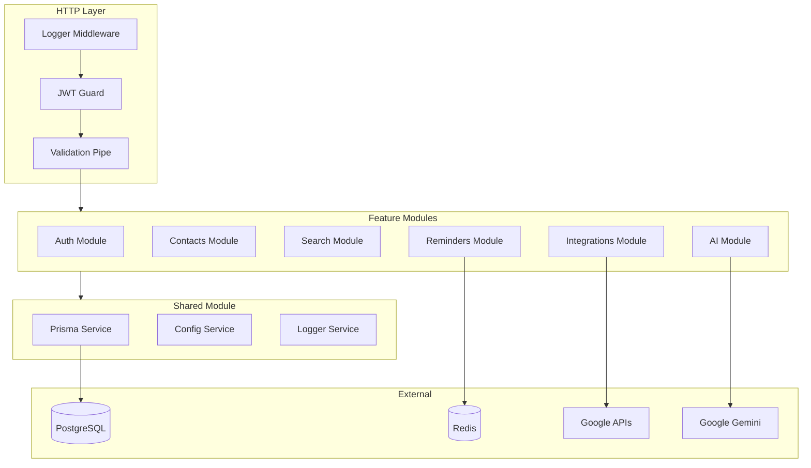

# Backend AGENTS.md

## Overview

NestJS 11 backend implementing a modular monolith architecture. Provides REST API for the Personal Network CRM with authentication, contact management, integrations, and AI features.

## Directory Structure

```
backend/
├── src/
│   ├── main.ts                    # Application entry point
│   ├── app.module.ts              # Root module
│   ├── app.controller.ts          # Health check endpoint
│   ├── lib/                       # Shared utilities
│   │   └── auth.ts                # Auth helpers
│   ├── modules/                   # Feature modules
│   │   └── AGENTS.md              # -> [Module Patterns](src/modules/AGENTS.md)
│   └── shared/                    # Shared infrastructure
│       ├── config/                # Configuration
│       ├── database/              # Prisma service
│       ├── decorators/            # Custom decorators
│       ├── filters/               # Exception filters
│       ├── guards/                # Auth guards
│       ├── interceptors/          # Response transformers
│       ├── middleware/            # HTTP middleware
│       └── pipes/                 # Validation pipes
├── prisma/
│   ├── schema.prisma              # Database schema
│   └── migrations/                # Database migrations
├── test/
│   └── AGENTS.md                  # -> [Test Patterns](test/AGENTS.md)
└── package.json
```

## Setup Commands

```bash
cd backend

pnpm install                       # Install dependencies
pnpm docker:up                     # Start PostgreSQL + Redis
pnpm prisma:generate               # Generate Prisma client
pnpm prisma:migrate                # Run migrations
pnpm db:push                       # Push schema (dev only)
```

## Development Commands

```bash
pnpm dev                           # Start dev server on port 3001
pnpm start:debug                   # Start with debugger
pnpm test                          # Run unit tests
pnpm test:watch                    # Watch mode
pnpm test:cov                      # Coverage report
pnpm test:e2e                      # E2E tests
pnpm test:integration              # Integration tests
pnpm lint                          # ESLint
```

## Architecture Diagram



## Example Files

### Controller Pattern

Reference: [src/modules/contacts/contacts.controller.ts](src/modules/contacts/contacts.controller.ts)

Key patterns:
- `@ApiTags()` for Swagger grouping
- `@ApiBearerAuth()` for auth documentation
- `@ApiOperation()` + `@ApiResponse()` for endpoint docs
- Request user extracted via `@Request() req`

### Service Pattern

Reference: [src/modules/contacts/contacts.service.ts](src/modules/contacts/contacts.service.ts)

Key patterns:
- Constructor injection of PrismaService and other services
- Transaction support via `prisma.$transaction()`
- Soft deletes with `deletedAt` field
- User-scoped queries (always include `userId` in where clause)

### DTO Pattern

Reference: [src/modules/contacts/dto/create-contact.dto.ts](src/modules/contacts/dto/create-contact.dto.ts)

```typescript
import { IsString, IsEmail, IsOptional, IsArray } from 'class-validator';
import { ApiProperty, ApiPropertyOptional } from '@nestjs/swagger';

export class CreateContactDto {
  @ApiProperty({ description: 'First name', example: 'John' })
  @IsString()
  firstName: string;

  @ApiPropertyOptional()
  @IsOptional()
  @IsEmail()
  email?: string;

  @ApiPropertyOptional({ type: [String] })
  @IsOptional()
  @IsArray()
  @IsString({ each: true })
  tags?: string[];
}
```

### Module Pattern

Reference: [src/modules/contacts/contacts.module.ts](src/modules/contacts/contacts.module.ts)

```typescript
import { Module } from '@nestjs/common';
import { ContactsController } from './contacts.controller';
import { ContactsService } from './contacts.service';

@Module({
  controllers: [ContactsController],
  providers: [ContactsService],
  exports: [ContactsService],
})
export class ContactsModule {}
```

## Key Conventions

### User Scoping

All data operations must be scoped to the authenticated user:

```typescript
// ✅ Correct - includes userId
const contacts = await this.prisma.contact.findMany({
  where: { userId, deletedAt: null },
});

// ❌ Wrong - missing userId
const contacts = await this.prisma.contact.findMany({
  where: { deletedAt: null },
});
```

### Error Handling

Use NestJS built-in exceptions:

```typescript
import { NotFoundException, BadRequestException } from '@nestjs/common';

if (!contact) {
  throw new NotFoundException('Contact not found');
}

if (!isValidEmail(email)) {
  throw new BadRequestException('Invalid email format');
}
```

### Soft Deletes

Contacts support soft deletion:

```typescript
// Delete (soft)
await this.prisma.contact.update({
  where: { id: contactId },
  data: { deletedAt: new Date() },
});

// Always filter out deleted records
where: { deletedAt: null }
```

## API Versioning

All endpoints are prefixed with `/api/v1/`:

```
GET  /api/v1/contacts
POST /api/v1/contacts
GET  /api/v1/contacts/:id
...
```

## Database Schema

Schema location: [prisma/schema.prisma](prisma/schema.prisma)

Key models:
- `User` - Authentication and profile
- `Contact` - Network contacts with enrichment data
- `Reminder` - Follow-up reminders
- `Integration` - OAuth tokens for external services
- `Interaction` - Meetings, calls, emails
- `Organization` - Multi-tenancy (better-auth)

## Environment Variables

```bash
# Required
DATABASE_URL="postgresql://..."
BETTER_AUTH_SECRET="..."
BETTER_AUTH_URL="http://localhost:3001"
REDIS_URL="redis://localhost:6379"

# Google OAuth
GOOGLE_CLIENT_ID="..."
GOOGLE_CLIENT_SECRET="..."

# AI
GOOGLE_GEMINI_API_KEY="..."

# Optional
PROXYCURL_API_KEY="..."  # LinkedIn enrichment
```

## Testing

See [test/AGENTS.md](test/AGENTS.md) for detailed testing patterns.

Quick commands:
```bash
pnpm test                          # Unit tests
pnpm test:integration              # Integration (needs DB)
pnpm test:e2e                      # E2E (needs full stack)
```


