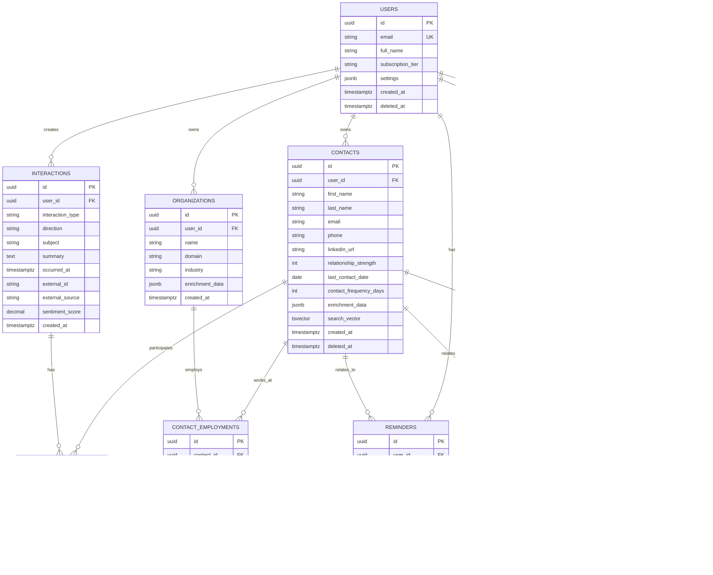

# Database Schema Documentation

## Overview

Personal Network CRM uses PostgreSQL 16+ with the pgvector extension for vector embeddings. The database follows a multi-tenant architecture with Row-Level Security (RLS) for tenant isolation.

## Entity Relationship Diagram



## Core Tables

### users

Primary tenant table storing user accounts.

| Column | Type | Nullable | Default | Description |
|--------|------|----------|---------|-------------|
| id | UUID | NO | uuid_generate_v4() | Primary key |
| email | VARCHAR(255) | NO | - | Unique email address |
| full_name | VARCHAR(255) | NO | - | User's full name |
| subscription_tier | VARCHAR(50) | YES | 'free' | Subscription level: free, pro, team |
| settings | JSONB | YES | '{}' | User preferences and settings |
| created_at | TIMESTAMPTZ | NO | NOW() | Account creation timestamp |
| deleted_at | TIMESTAMPTZ | YES | NULL | Soft delete timestamp |

**Indexes:**
- `idx_users_email` on email (unique)
- `idx_users_active` on id WHERE deleted_at IS NULL

**RLS:** Not enabled (no tenant isolation needed)

---

### contacts

Core entity storing contact information.

| Column | Type | Nullable | Default | Description |
|--------|------|----------|---------|-------------|
| id | UUID | NO | uuid_generate_v4() | Primary key |
| user_id | UUID | NO | - | Foreign key to users |
| first_name | VARCHAR(255) | NO | - | Contact's first name |
| last_name | VARCHAR(255) | YES | - | Contact's last name |
| email | VARCHAR(255) | YES | - | Primary email address |
| phone | VARCHAR(50) | YES | - | Primary phone number |
| linkedin_url | TEXT | YES | - | LinkedIn profile URL |
| relationship_strength | INTEGER | YES | 5 | Score 1-10 indicating relationship strength |
| last_contact_date | DATE | YES | - | Most recent interaction date |
| contact_frequency_days | INTEGER | YES | - | Target days between contacts |
| enrichment_data | JSONB | YES | '{}' | Data from LinkedIn, Apollo, etc. |
| search_vector | TSVECTOR | YES | - | Full-text search vector |
| created_at | TIMESTAMPTZ | NO | NOW() | Record creation timestamp |
| deleted_at | TIMESTAMPTZ | YES | NULL | Soft delete timestamp |

**Indexes:**
- `idx_contacts_user` on user_id WHERE deleted_at IS NULL
- `idx_contacts_email` on user_id, email
- `idx_contacts_last_contact` on user_id, last_contact_date DESC
- `idx_contacts_search` on search_vector (GIN)
- `idx_contacts_relationship` on user_id, relationship_strength

**RLS:** Enabled with policy `tenant_isolation_contacts`

**Constraints:**
- `CHECK (relationship_strength BETWEEN 1 AND 10)`
- `FOREIGN KEY (user_id) REFERENCES users(id) ON DELETE CASCADE`

---

### organizations

Companies and organizations where contacts work.

| Column | Type | Nullable | Default | Description |
|--------|------|----------|---------|-------------|
| id | UUID | NO | uuid_generate_v4() | Primary key |
| user_id | UUID | NO | - | Foreign key to users |
| name | VARCHAR(255) | NO | - | Organization name |
| domain | VARCHAR(255) | YES | - | Website domain |
| industry | VARCHAR(100) | YES | - | Industry classification |
| enrichment_data | JSONB | YES | '{}' | Company data from Clearbit, etc. |
| created_at | TIMESTAMPTZ | NO | NOW() | Record creation timestamp |

**Indexes:**
- `idx_organizations_user` on user_id
- `idx_organizations_domain` on domain

**RLS:** Enabled with policy `tenant_isolation_organizations`

---

### contact_employments

Junction table with history tracking for contact-organization relationships.

| Column | Type | Nullable | Default | Description |
|--------|------|----------|---------|-------------|
| id | UUID | NO | uuid_generate_v4() | Primary key |
| contact_id | UUID | NO | - | Foreign key to contacts |
| organization_id | UUID | NO | - | Foreign key to organizations |
| title | VARCHAR(255) | YES | - | Job title |
| start_date | DATE | YES | - | Employment start date |
| end_date | DATE | YES | - | Employment end date |
| is_current | BOOLEAN | YES | TRUE | Whether this is current employment |

**Indexes:**
- `idx_employments_contact` on contact_id
- `idx_employments_organization` on organization_id
- `idx_employments_current` on contact_id, is_current WHERE is_current = TRUE

**Constraints:**
- `UNIQUE (contact_id, organization_id, start_date)`

---

### interactions

Communication history and touchpoints.

| Column | Type | Nullable | Default | Description |
|--------|------|----------|---------|-------------|
| id | UUID | NO | uuid_generate_v4() | Primary key |
| user_id | UUID | NO | - | Foreign key to users |
| interaction_type | VARCHAR(50) | NO | - | Type: email, meeting, call, linkedin, etc. |
| direction | VARCHAR(20) | YES | - | inbound, outbound, mutual |
| subject | VARCHAR(500) | YES | - | Email subject or meeting title |
| summary | TEXT | YES | - | Interaction summary or notes |
| occurred_at | TIMESTAMPTZ | NO | - | When interaction occurred |
| external_id | VARCHAR(255) | YES | - | ID from external system (Gmail, Calendar) |
| external_source | VARCHAR(50) | YES | - | Source system: gmail, google_calendar, etc. |
| sentiment_score | DECIMAL(3,2) | YES | - | Sentiment analysis score -1.0 to 1.0 |
| created_at | TIMESTAMPTZ | NO | NOW() | Record creation timestamp |

**Indexes:**
- `idx_interactions_user` on user_id
- `idx_interactions_occurred` on user_id, occurred_at DESC
- `idx_interactions_external` on external_source, external_id
- `idx_interactions_type` on user_id, interaction_type

**RLS:** Enabled with policy `tenant_isolation_interactions`

**Constraints:**
- `CHECK (sentiment_score BETWEEN -1.0 AND 1.0)`

---

### interaction_participants

Many-to-many relationship between interactions and contacts.

| Column | Type | Nullable | Default | Description |
|--------|------|----------|---------|-------------|
| interaction_id | UUID | NO | - | Foreign key to interactions |
| contact_id | UUID | NO | - | Foreign key to contacts |

**Indexes:**
- `idx_participants_interaction` on interaction_id
- `idx_participants_contact` on contact_id

**Constraints:**
- `PRIMARY KEY (interaction_id, contact_id)`

---

### reminders

User-created reminders and system-generated follow-up suggestions.

| Column | Type | Nullable | Default | Description |
|--------|------|----------|---------|-------------|
| id | UUID | NO | uuid_generate_v4() | Primary key |
| user_id | UUID | NO | - | Foreign key to users |
| contact_id | UUID | YES | - | Optional: related contact |
| title | VARCHAR(255) | NO | - | Reminder title |
| due_at | TIMESTAMPTZ | NO | - | When reminder is due |
| status | VARCHAR(20) | YES | 'pending' | pending, completed, dismissed |
| recurrence_rule | VARCHAR(255) | YES | - | iCal RRULE format for recurring reminders |

**Indexes:**
- `idx_reminders_user` on user_id
- `idx_reminders_due` on user_id, due_at WHERE status = 'pending'
- `idx_reminders_contact` on contact_id

**RLS:** Enabled with policy `tenant_isolation_reminders`

---

### ai_insights

AI-generated networking recommendations and insights.

| Column | Type | Nullable | Default | Description |
|--------|------|----------|---------|-------------|
| id | UUID | NO | uuid_generate_v4() | Primary key |
| user_id | UUID | NO | - | Foreign key to users |
| contact_id | UUID | YES | - | Related contact (if applicable) |
| insight_type | VARCHAR(50) | NO | - | reconnect, job_change, milestone, etc. |
| title | VARCHAR(255) | NO | - | Insight headline |
| description | TEXT | YES | - | Detailed description |
| confidence_score | DECIMAL(3,2) | YES | - | AI confidence 0.0-1.0 |
| priority | INTEGER | YES | 5 | Priority 1-10 |
| status | VARCHAR(20) | YES | 'pending' | pending, acted_upon, dismissed |
| reasoning | JSONB | YES | - | AI reasoning and data sources |
| expires_at | TIMESTAMPTZ | YES | - | When insight becomes stale |
| created_at | TIMESTAMPTZ | NO | NOW() | Record creation timestamp |

**Indexes:**
- `idx_insights_user` on user_id
- `idx_insights_status` on user_id, status, priority WHERE status = 'pending'
- `idx_insights_contact` on contact_id
- `idx_insights_type` on insight_type

**RLS:** Enabled with policy `tenant_isolation_ai_insights`

**Constraints:**
- `CHECK (confidence_score BETWEEN 0.0 AND 1.0)`
- `CHECK (priority BETWEEN 1 AND 10)`

---

### tags

User-defined tags for organizing contacts.

| Column | Type | Nullable | Default | Description |
|--------|------|----------|---------|-------------|
| id | UUID | NO | uuid_generate_v4() | Primary key |
| user_id | UUID | NO | - | Foreign key to users |
| name | VARCHAR(100) | NO | - | Tag name |
| color | VARCHAR(7) | YES | - | Hex color code |

**Indexes:**
- `idx_tags_user` on user_id

**Constraints:**
- `UNIQUE (user_id, name)`

---

### contact_tags

Many-to-many relationship between contacts and tags.

| Column | Type | Nullable | Default | Description |
|--------|------|----------|---------|-------------|
| contact_id | UUID | NO | - | Foreign key to contacts |
| tag_id | UUID | NO | - | Foreign key to tags |

**Indexes:**
- `idx_contact_tags_contact` on contact_id
- `idx_contact_tags_tag` on tag_id

**Constraints:**
- `PRIMARY KEY (contact_id, tag_id)`

## Advanced Features

### Full-Text Search

The `contacts` table includes a `search_vector` column (TSVECTOR) for efficient full-text search:

```sql
-- Trigger to automatically update search vector
CREATE OR REPLACE FUNCTION contacts_search_update() RETURNS trigger AS $$
BEGIN
  NEW.search_vector :=
    setweight(to_tsvector('english', coalesce(NEW.first_name, '')), 'A') ||
    setweight(to_tsvector('english', coalesce(NEW.last_name, '')), 'A') ||
    setweight(to_tsvector('english', coalesce(NEW.email, '')), 'B');
  RETURN NEW;
END;
$$ LANGUAGE plpgsql;

CREATE TRIGGER contacts_search_update_trigger
  BEFORE INSERT OR UPDATE ON contacts
  FOR EACH ROW EXECUTE FUNCTION contacts_search_update();
```

### Vector Embeddings (pgvector)

For semantic search capabilities:

```sql
-- Extension
CREATE EXTENSION IF NOT EXISTS vector;

-- Vector embeddings table
CREATE TABLE contact_embeddings (
    contact_id UUID PRIMARY KEY REFERENCES contacts(id) ON DELETE CASCADE,
    embedding vector(1536),  -- OpenAI ada-002 dimensions
    model VARCHAR(50) NOT NULL,
    updated_at TIMESTAMPTZ DEFAULT NOW()
);

-- HNSW index for fast similarity search
CREATE INDEX idx_contact_embeddings_hnsw
    ON contact_embeddings
    USING hnsw (embedding vector_cosine_ops);
```

### Partitioning Strategy

For tables that grow large (>100M rows), use declarative partitioning:

```sql
-- Partition interactions by month
CREATE TABLE interactions (
    -- columns
) PARTITION BY RANGE (occurred_at);

CREATE TABLE interactions_2025_01 PARTITION OF interactions
    FOR VALUES FROM ('2025-01-01') TO ('2025-02-01');

CREATE TABLE interactions_2025_02 PARTITION OF interactions
    FOR VALUES FROM ('2025-02-01') TO ('2025-03-01');
```

## Row-Level Security Policies

All tenant-scoped tables have RLS enabled:

```sql
-- Contacts RLS
CREATE POLICY tenant_isolation_contacts ON contacts
    USING (user_id = current_setting('app.current_user_id')::UUID);

CREATE POLICY tenant_isolation_contacts_insert ON contacts
    FOR INSERT
    WITH CHECK (user_id = current_setting('app.current_user_id')::UUID);

-- Similar policies for: organizations, interactions, reminders, ai_insights, tags
```

## Audit Logging

For compliance and debugging:

```sql
CREATE TABLE audit_logs (
    id UUID PRIMARY KEY DEFAULT uuid_generate_v4(),
    user_id UUID,
    table_name VARCHAR(100) NOT NULL,
    record_id UUID,
    action VARCHAR(20) NOT NULL,  -- INSERT, UPDATE, DELETE
    old_values JSONB,
    new_values JSONB,
    ip_address INET,
    user_agent TEXT,
    created_at TIMESTAMPTZ DEFAULT NOW()
);

-- Partition by month for performance
CREATE TABLE audit_logs (
    -- columns
) PARTITION BY RANGE (created_at);
```

## Database Migrations

We use Prisma for schema management:

```bash
# Create migration
npx prisma migrate dev --name add_contact_preferences

# Apply migrations
npx prisma migrate deploy

# Generate client
npx prisma generate
```

## Performance Considerations

1. **Connection Pooling**: Use PgBouncer in transaction mode
2. **Prepared Statements**: Prisma uses prepared statements by default
3. **Index Monitoring**: Regularly check index usage with `pg_stat_user_indexes`
4. **Vacuum**: Auto-vacuum configured, manual vacuum for large deletes
5. **Query Performance**: Use `EXPLAIN ANALYZE` for slow queries

## Backup Strategy

- **Continuous Backup**: Point-in-time recovery (PITR) enabled
- **Daily Snapshots**: Automated daily snapshots retained for 30 days
- **Retention**: 7 days for development, 30 days for production
- **Testing**: Quarterly restore tests

## Monitoring

Key metrics to track:

- Connection count and pool saturation
- Query latency (p50, p95, p99)
- Table and index sizes
- Cache hit ratio (should be >99%)
- Replication lag (if using read replicas)
- Lock contention
