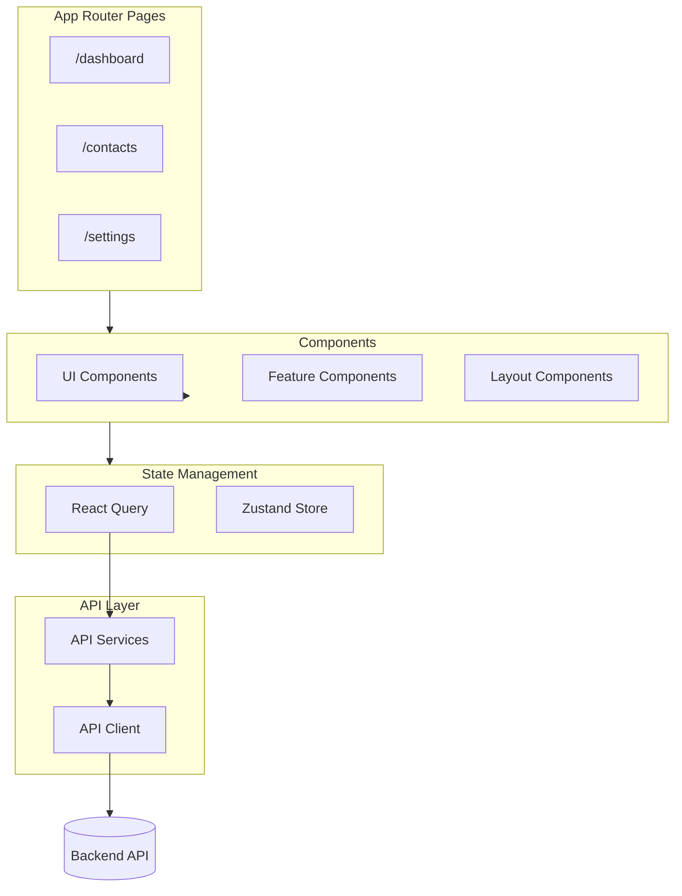

# Frontend AGENTS.md

## Overview

Next.js 16 frontend with App Router, React 19, and TypeScript. Uses shadcn/ui components, React Query for server state, and Zustand for client state.

## Tech Stack

| Technology | Purpose |
|------------|---------|
| Next.js 16 | App Router, SSR, API routes |
| React 19 | UI framework |
| TypeScript | Type safety |
| React Query | Server state management |
| Zustand | Client state management |
| shadcn/ui | Component library (Radix UI) |
| Tailwind CSS v4 | Styling |
| Zod | Schema validation |
| Vitest | Unit testing |

## Directory Structure

```
frontend/
├── src/
│   ├── AGENTS.md                  # -> [Source Patterns](src/AGENTS.md)
│   ├── app/                       # Next.js App Router pages
│   ├── components/                # React components
│   ├── hooks/                     # Custom React hooks
│   ├── lib/                       # Utilities and API clients
│   ├── providers/                 # Context providers
│   ├── store/                     # Zustand stores
│   └── types/                     # TypeScript types
├── public/                        # Static assets
├── package.json
├── next.config.ts
├── tailwind.config.ts
└── tsconfig.json
```

## Setup Commands

```bash
cd frontend

pnpm install                       # Install dependencies
pnpm dev                           # Start dev server on port 3000
pnpm build                         # Production build
pnpm start                         # Start production server
```

## Development Commands

```bash
pnpm dev                           # Development server
pnpm build                         # Production build
pnpm lint                          # ESLint
pnpm test                          # Vitest tests
pnpm test:watch                    # Watch mode
pnpm test:coverage                 # Coverage report
```

## Architecture Diagram



## Example Files

### Custom Hook Pattern

Reference: [src/hooks/use-contacts.ts](src/hooks/use-contacts.ts)

Key patterns:
- `useQuery` for data fetching
- `useMutation` for data modification
- Query key management via `queryKeys`
- Automatic cache invalidation on mutations

### API Service Pattern

Reference: [src/lib/api/services/contacts.service.ts](src/lib/api/services/contacts.service.ts)

Key patterns:
- Typed API client wrapper
- Response transformation
- Error handling

### UI Component Pattern

Reference: [src/components/ui/button.tsx](src/components/ui/button.tsx)

Key patterns:
- `class-variance-authority` for variants
- `forwardRef` for ref forwarding
- Tailwind CSS classes

## Key Conventions

### File Naming

- Components: `PascalCase.tsx`
- Hooks: `use-{name}.ts`
- Services: `{name}.service.ts`
- Types: `{name}.ts` in `types/`
- Pages: `page.tsx` (App Router)

### Component Structure

```typescript
// Standard component structure
import { cn } from '@/lib/utils';

interface Props {
  // Props interface
}

export function ComponentName({ prop1, prop2 }: Props) {
  // Hooks first
  const { data } = useQuery();

  // Handlers
  const handleClick = () => {};

  // Render
  return <div className={cn('base-classes', conditional && 'conditional-class')}>{/* content */}</div>;
}
```

### Hook Structure

```typescript
import { useQuery, useMutation, useQueryClient } from '@tanstack/react-query';
import { queryKeys } from '@/lib/react-query';
import { resourceService } from '@/lib/api';

export function useResource() {
  return useQuery({
    queryKey: queryKeys.resource.list(),
    queryFn: resourceService.getAll,
  });
}

export function useCreateResource() {
  const queryClient = useQueryClient();

  return useMutation({
    mutationFn: resourceService.create,
    onSuccess: () => {
      queryClient.invalidateQueries({ queryKey: queryKeys.resource.lists() });
    },
  });
}
```

## Environment Variables

```bash
# Required
NEXT_PUBLIC_API_URL="http://localhost:3001/api/v1"

# Optional
NEXT_PUBLIC_GOOGLE_CLIENT_ID="..."
```

## Testing

```bash
pnpm test                          # Run all tests
pnpm test:watch                    # Watch mode
pnpm test:coverage                 # Coverage report
```

Test location: Co-located with source files as `*.test.ts(x)`

## More Details

See [src/AGENTS.md](src/AGENTS.md) for detailed patterns in components, hooks, and lib.


