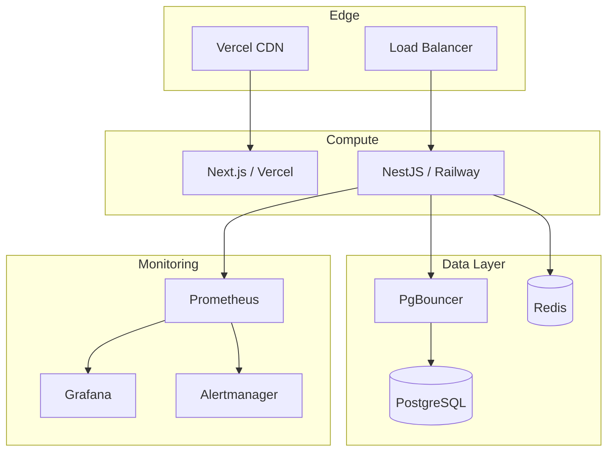

# Infrastructure AGENTS.md

## Overview

Infrastructure configurations for deployment, monitoring, and operations. Supports multiple deployment targets: Railway, Vercel, AWS, and Docker.

## Directory Structure

```
infrastructure/
├── AGENTS.md                      # You are here
├── README.md                      # Infrastructure overview
├── AWS_SETUP.md                   # AWS deployment guide
├── BACKUP_RECOVERY.md             # Backup procedures
├── DEPLOYMENT_GUIDE.md            # General deployment guide
├── DOCKER_GUIDE.md                # Docker configuration
├── MONITORING_SETUP.md            # Monitoring setup
├── RAILWAY_SETUP.md               # Railway deployment
├── ROLLBACK_GUIDE.md              # Rollback procedures
├── VERCEL_SETUP.md                # Vercel deployment
├── monitoring/                    # Monitoring configs
│   ├── grafana-dashboard.json     # Grafana dashboard
│   └── prometheus.yml             # Prometheus config
├── nginx/                         # Nginx reverse proxy
│   ├── nginx.conf                 # Main config
│   └── conf.d/
│       └── default.conf           # Site config
├── postgres/                      # PostgreSQL/PgBouncer
│   ├── Dockerfile.pgbouncer       # PgBouncer image
│   ├── pgbouncer.ini              # PgBouncer config
│   └── userlist.txt               # PgBouncer users
├── redis/                         # Redis configs
└── terraform/                     # Infrastructure as Code
    ├── main.tf                    # Main Terraform config
    ├── variables.tf               # Variable definitions
    └── terraform.tfvars.example   # Example variables
```

## Deployment Targets

### Railway (Recommended for MVP)

Reference: [RAILWAY_SETUP.md](RAILWAY_SETUP.md)

Quick deploy:
```bash
# Install Railway CLI
npm i -g @railway/cli

# Login and link project
railway login
railway link

# Deploy
railway up
```

### Vercel (Frontend)

Reference: [VERCEL_SETUP.md](VERCEL_SETUP.md)

Quick deploy:
```bash
# Install Vercel CLI
npm i -g vercel

# Deploy frontend
cd frontend
vercel
```

### AWS (Production)

Reference: [AWS_SETUP.md](AWS_SETUP.md)

Uses Terraform for infrastructure provisioning.

### Docker (Self-hosted)

Reference: [DOCKER_GUIDE.md](DOCKER_GUIDE.md)

```bash
# Development
docker-compose up -d

# Production
docker-compose -f docker-compose.prod.yml up -d
```

## Configuration Files

### Nginx

Reference: [nginx/nginx.conf](nginx/nginx.conf)

Reverse proxy configuration for production:
- SSL termination
- Rate limiting
- Proxy headers
- Gzip compression

### PgBouncer

Reference: [postgres/pgbouncer.ini](postgres/pgbouncer.ini)

Connection pooling for PostgreSQL:
- Pool mode: transaction
- Default pool size: 20
- Max client connections: 100

### Prometheus

Reference: [monitoring/prometheus.yml](monitoring/prometheus.yml)

Metrics collection:
- Backend health endpoint
- PostgreSQL exporter
- Redis exporter
- Node exporter

### Grafana Dashboard

Reference: [monitoring/grafana-dashboard.json](monitoring/grafana-dashboard.json)

Pre-built dashboard with:
- Request rate and latency
- Database connections
- Redis memory usage
- Error rates

## Terraform

### Structure

```
terraform/
├── main.tf              # Resources (ECS, RDS, ElastiCache)
├── variables.tf         # Input variables
└── terraform.tfvars.example  # Example values
```

### Usage

```bash
cd infrastructure/terraform

# Initialize
terraform init

# Plan
terraform plan -var-file="terraform.tfvars"

# Apply
terraform apply -var-file="terraform.tfvars"
```

## Operations Guides

| Guide | Purpose |
|-------|---------|
| [DEPLOYMENT_GUIDE.md](DEPLOYMENT_GUIDE.md) | Step-by-step deployment |
| [BACKUP_RECOVERY.md](BACKUP_RECOVERY.md) | Database backup/restore |
| [ROLLBACK_GUIDE.md](ROLLBACK_GUIDE.md) | Version rollback procedures |
| [MONITORING_SETUP.md](MONITORING_SETUP.md) | Monitoring configuration |

## Environment Variables

### Required for Production

```bash
# Database
DATABASE_URL="postgresql://..."
DIRECT_DATABASE_URL="postgresql://..."  # For migrations

# Auth
BETTER_AUTH_SECRET="..."
BETTER_AUTH_URL="https://api.yourapp.com"

# Redis
REDIS_URL="redis://..."

# Google OAuth
GOOGLE_CLIENT_ID="..."
GOOGLE_CLIENT_SECRET="..."

# AI
GOOGLE_GEMINI_API_KEY="..."
```

### Platform-Specific

**Railway:**
```bash
RAILWAY_ENVIRONMENT="production"
```

**Vercel:**
```bash
NEXT_PUBLIC_API_URL="https://api.yourapp.com/api/v1"
```

## Deployment Architecture



## Quick Commands

```bash
# Local development
pnpm docker:up                     # Start PostgreSQL + Redis
pnpm dev                           # Start all services

# Production deployment (Railway)
railway up                         # Deploy to Railway

# Production deployment (Docker)
docker-compose -f docker-compose.prod.yml up -d

# Database backup
pg_dump $DATABASE_URL > backup.sql

# Restore database
psql $DATABASE_URL < backup.sql
```

## Security Checklist

- [ ] SSL/TLS configured
- [ ] Environment variables secured
- [ ] Database not publicly accessible
- [ ] Rate limiting enabled
- [ ] CORS properly configured
- [ ] Secrets rotated regularly
- [ ] Monitoring alerts configured


